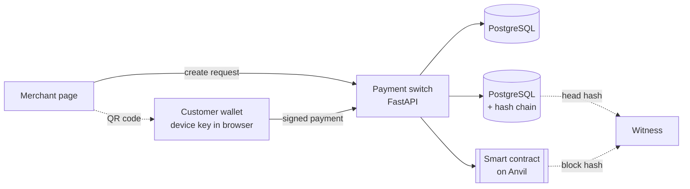

# UPI Lab

A small UPI-style payment system built to answer one question:

> Does a blockchain add anything to a payment ledger that a database cannot?

The same customer-to-merchant payment runs on three interchangeable ledgers:

| Ledger | What it is |
|---|---|
| `plain` | PostgreSQL tables |
| `chained` | PostgreSQL with a hash-chained journal, plus checkpoints handed to an outside witness |
| `contract` | A Solidity smart contract on a local Ethereum chain (Anvil), called with web3.py |

Only the ledger changes. Signatures, idempotency and single-use payment requests are identical for all three,
so the comparison is fair.

## Findings

### Which ledger notices when an insider cheats?

Anna makes three signed payments. An insider with full access to the database and the chain then changes the first one.
`naive_edit` changes one stored value. `full_rewrite` also fixes up everything else so the ledger is internally consistent.

| Ledger | Attack | Ledger's own check | Witness |
|---|---|---|---|
| PostgreSQL | naive edit | no check exists | no witness possible |
| PostgreSQL | full rewrite | no check exists | no witness possible |
| Hash chain | naive edit | **detected** | missed |
| Hash chain | full rewrite | missed | **detected** |
| Smart contract | naive edit | **detected** | missed |
| Smart contract | full rewrite | missed | **detected** |

The hash chain and the smart contract behave the same. A full rewrite passes each ledger's own check, and is caught
only because a witness holds an earlier fingerprint. On the blockchain, the rewrite works by rolling the chain back and
replaying it, which is possible because a single operator runs the only node.

### Speed and cost

Same 20 customers and balances on every ledger, full switch path, 300 payments per ledger (20 for 1 s blocks).

| Ledger | Median | 95th percentile | Payments per second (8 in parallel) | Gas per payment |
|---|---|---|---|---|
| PostgreSQL | 7.4 ms | 10.0 ms | 203 | - |
| PostgreSQL + hash chain | 8.2 ms | 11.7 ms | 232 | - |
| Smart contract, instant blocks | 17.7 ms | 32.6 ms | 76 | 58 540 |
| Smart contract, 1 s blocks | 983 ms | 1 000 ms | 7 | 58 890 |

Measured on one MacBook with Docker. The numbers show relative behaviour, not production performance.

### Conclusion

1. Tamper evidence comes from a hash-linked history and someone else holding the latest hash, not from a blockchain as such.
   PostgreSQL with a hash chain and a witness detects the same attacks.
2. A single-operator blockchain costs latency (2.4x with instant blocks, over 100x with 1 s blocks), throughput and gas,
   and its operator can still rewrite it.
3. A blockchain adds something only when several independent organisations each run a node and validate, so the
   witness is built into the system. That is the case to study next.

Charts and tables: [`results.ipynb`](results.ipynb). Raw data: [`results/`](results/).

## How a payment works



1. The merchant creates a payment request: payee, amount, reference, ledger, and a 5-minute expiry. The QR code holds
   a UPI-style link: `upilab://pay?pa=cafe@lab&am=45.50&cu=SEK&tr=<request id>`.
2. The customer's wallet reads it and shows the switch's record of the request, not the QR's claims. A tampered QR is refused.
3. The customer approves. The browser signs a fixed-format message with an Ed25519 key it created itself.
   The private key cannot be read out of the browser; the server only knows the public key.
4. The switch checks the signature against the payer's registered key, rebuilding the message from its own record,
   so the customer must have signed the real payee and amount.
5. The switch records the attempt under its idempotency key (a retry returns the first result), claims the request
   (only one payment can move it from PENDING to PAID), and moves the money on the chosen ledger.

## Design decisions

| Decision | Why |
|---|---|
| Money in integer ore, never floats | `0.1 + 0.2 != 0.3` in floating point |
| Check and subtract in one SQL statement, with row locks in a fixed order | prevents lost updates and deadlocks; `race_demo.py` shows the naive version creating money |
| Idempotency key per payment attempt, stored with a UNIQUE constraint | a retry after a network failure can never charge twice |
| Customer keys created in the browser, non-extractable | a signature proves the customer approved, not the server |
| Ledgers share one set of functions (`transfer_in`, `balance`, `open_account`, `reset`) | the switch can use any of them; that is what makes the comparison fair |
| The request id is the transfer id on the blockchain | the chain cannot join the database transaction, so the contract itself refuses to pay one request twice |

## Run it

Needs Docker and Python 3.11+.

```bash
# PostgreSQL, a chain with instant blocks, and a chain with 1-second blocks
docker run -d --name upi-pg -e POSTGRES_PASSWORD=postgres -e POSTGRES_DB=upilab -p 5433:5432 postgres:16
docker run -d --name upi-anvil -p 8545:8545 --entrypoint anvil ghcr.io/foundry-rs/foundry:stable --host 0.0.0.0
docker run -d --name upi-anvil-1s -p 8546:8545 --entrypoint anvil ghcr.io/foundry-rs/foundry:stable --host 0.0.0.0 --block-time 1

python3 -m venv .venv
source .venv/bin/activate
python -m pip install -r requirements.txt
python compile_contract.py        # only needed after changing the contract

python -m pytest -q               # tests (they reset the database)
python -m uvicorn api:app --reload
```

Then reset the demo data with `curl -X POST http://127.0.0.1:8000/api/admin/reset` and open
`http://127.0.0.1:8000/merchant.html` and `http://127.0.0.1:8000/customer.html`.
In the wallet, press "Create device key" after every reset.

Experiments:

```bash
python tamper.py
python bench.py
RPC_URL=http://127.0.0.1:8546 python bench.py --label "contract, 1 s blocks" --ledgers contract --n 20
jupyter nbconvert --to notebook --execute --inplace results.ipynb
```

## Files

| File | What it does |
|---|---|
| `money.py` | SEK parsing and formatting in integer ore |
| `ledger.py` | PostgreSQL ledger: atomic, race-free transfers |
| `chain.py` | Hash-chained PostgreSQL ledger with `verify()` |
| `contract.py`, `contracts/PaymentLedger.sol` | Smart contract ledger |
| `witness.py` | Keeps outside copies of a ledger's latest hash |
| `crypto.py` | Signed payment messages (Ed25519) |
| `switch.py` | Payment requests, signatures, idempotency, ledger choice |
| `api.py` | HTTP API and QR codes (FastAPI) |
| `web/` | Merchant terminal and customer wallet |
| `race_demo.py` | Shows why a naive read-then-write transfer creates money |
| `tamper.py`, `bench.py` | The two experiments |
| `test_*.py` | 43 tests, including concurrency and attack cases |

## Limits

- **One operator.** The blockchain has a single node run by the switch. The obvious next experiment is a permissioned
  network with several validators (for example Hyperledger Besu with QBFT), where each bank runs a node.
- **The witness is a file.** In practice checkpoints would be signed and sent to parties who keep them: the other banks,
  an auditor, or a public log.
- **The key registry is trusted.** The switch trusts that a registered key really belongs to the customer.
  UPI binds keys to the SIM card and bank card; Sweden would use BankID.
- **Local measurements.** One machine, local chains, no network latency. Relative numbers only.
- **No settlement between banks.** The prototype stops at the ledger.
